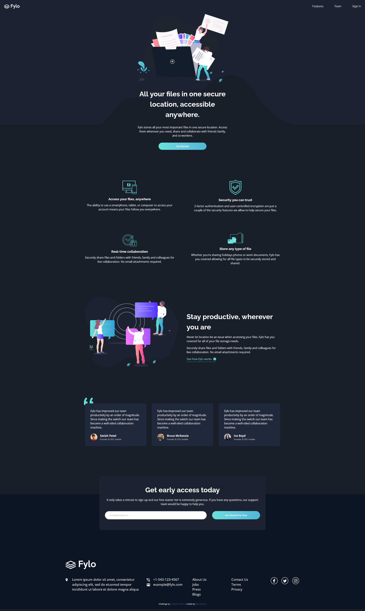

# Frontend Mentor - Fylo dark theme landing page solution

This is a solution to the [Fylo dark theme landing page challenge on Frontend Mentor](https://www.frontendmentor.io/challenges/fylo-dark-theme-landing-page-5ca5f2d21e82137ec91a50fd). Frontend Mentor challenges help you improve your coding skills by building realistic projects. 

## Table of contents

- [Overview](#overview)
  - [The challenge](#the-challenge)
  - [Screenshot](#screenshot)
  - [Links](#links)
- [My process](#my-process)
  - [Built with](#built-with)
  - [What I learned](#what-i-learned)
  - [Continued development](#continued-development)
  - [Useful resources](#useful-resources)
- [Author](#author)

## Overview

### The challenge

Users should be able to:

- View the optimal layout for the site depending on their device's screen size
- See hover states for all interactive elements on the page

### Screenshot

### Links

- Solution URL: [Add solution URL here](https://your-solution-url.com)
- Live Site URL: [https://crazeddoggo.github.io/FEM-Fylo-Dark-Theme-Landing-Page/](https://crazeddoggo.github.io/FEM-Fylo-Dark-Theme-Landing-Page/)

## My process

### Built with

- Semantic HTML5 markup
- CSS custom properties
- Flexbox
- CSS Grid
- Mobile-first workflow

### What I learned

While building my hero element, I had an issue with the background image in respect to the color. After the "wave" image, the background color completely changes to become the global dark blue. I decided to find a way to split the background-color into two, which I found online through linear gradients.

### Continued development

I initially started building this challenge while not feeling that well, and it can definitely be gutted and overhauled in the future. After coming back in a better state of mind, I decided to finish the footer and had to rewrite and deal with previous styles and cascading issues. I'll put this on my roadmap to possibly revisit this and overhaul it with a much more cleaner, elegant solution.

### Useful resources

[Split background color](https://stackoverflow.com/questions/8541081/css-set-a-background-color-which-is-50-of-the-width-of-the-window)

## Author

- GitHub - [Crazed Doggo](https://github.com/CrazedDoggo)
- Frontend Mentor - [@CrazedDoggo](https://www.frontendmentor.io/profile/CrazedDoggo)
- Twitter - [@DoggoCrazed](https://www.twitter.com/DoggoCrazed)